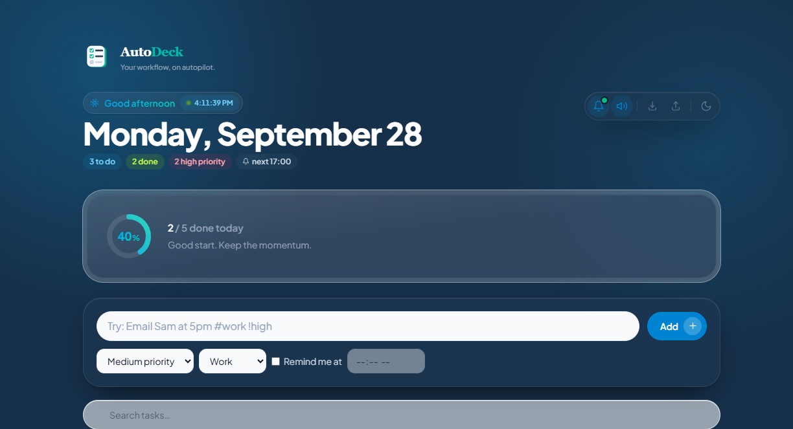

# AutoDeck

**Your workflow, on autopilot.** — a glassmorphic, single-page daily to-do app that resets each day and keeps you focused on *today*.

[](https://aditya20030420.github.io/autodeck/)
[](LICENSE)


> Vite + React 18 + Tailwind CSS v4. All UI logic lives in one component (`src/TodoApp.jsx`).

**▶︎ Try it live: https://aditya20030420.github.io/autodeck/**



## Get it

- **Web** — open the [live demo](https://aditya20030420.github.io/autodeck/) (works on any device; installable soon).
- **Windows desktop** — from the [Releases](https://github.com/Aditya20030420/autodeck/releases) page, grab **`AutoDeck-Setup-1.0.2.exe`** (installer, adds a Start Menu shortcut) or **`AutoDeck-Portable.exe`** (no install). Or build it yourself: `npm run electron:build`.

---

## Features

- **Daily focus** — shows today's date; unfinished tasks roll to today, finished old ones drop (local-time daily reset).
- **Daily Report & goal tracking** — a second tab that turns today's tasks into a shareable daily report: auto progress summary (goals / completed / remaining / %), blockers and notes, Draft→Finalize, and a per-date history that's snapshotted so past days survive the daily reset. Copy, download as text, or "mark shared" to paste to a manager (single-user — no backend).
- **Natural-language quick add** — type `Email Sam at 5pm #work !high` and it parses the time, category, and priority automatically.
- **Two boards** — Pending & Completed side by side, each accent-colored (teal / lime).
- **Rich tasks** — priority, category, reminders, **subtasks** (with per-task progress), pin, postpone, duplicate, inline edit.
- **Drag-and-drop reordering** (via `@dnd-kit`), live search, and icon-labeled filters (All / Active / Completed / High Priority / Work / Personal).
- **Reminder assistant** — schedule reminders by date + time with a **lead** (5/10/15/30 min, 1–2 h, or custom before) and **repeat until done** (every 5–120 min or custom). An always-visible dashboard banner lists what's due, **ordered and styled by priority** (High/Medium/Low), with a matching loud→soft alarm and desktop **browser notifications** (high-priority ones stay until dismissed). Per-reminder **Mark Done / Snooze / Dismiss / View task**, an **Overdue** indicator, and an **Upcoming reminders** table. Fires while the tab is open; mutable. *(No push server, so it can't alert when the browser is fully closed.)*
- **Per-event sound effects** (Web Audio) with a global on/off toggle.
- **Progress dashboard** — gradient progress ring (glows & pulses at 100%), header stat chips, and a time-of-day greeting with a live clock.
- **Export / Import** — download tasks as **PDF, CSV, Word (.doc), or JSON**; restore from a JSON backup.
- **Design** — frosted glassmorphism, teal→lime brand palette, light/dark themes, animated SVG icons, and an `AD` checklist logomark/favicon.
- **Persistence** — everything is saved to `localStorage`; no account or backend required.

## Tech stack

| | |
|---|---|
| Framework | React 18 (functional components + hooks) |
| Build | Vite 6 |
| Styling | Tailwind CSS v4 (`@tailwindcss/vite`), class-based dark mode |
| Icons | lucide-react + custom inline SVG |
| Drag & drop | @dnd-kit (core / sortable / utilities) |
| Exports | dependency-free CSV, jspdf + jspdf-autotable (lazy-loaded) |

## Getting started

```bash
npm install
npm run dev      # start the dev server (http://localhost:5173)
npm run build    # production build → dist/
npm run preview  # preview the production build
```

## Project structure

```
src/
  TodoApp.jsx      # the whole app (state, logic, all components)
  AutoDeckIcon.tsx # checklist "deck" logomark (used in header + favicon)
  AutoDeckLogo.tsx # standalone AD-monogram wordmark component
  index.css        # Tailwind + design tokens, keyframes, glass utilities
  main.jsx         # React entry
public/
  favicon.svg      # AutoDeck icon
```

## Notes

- Reminders fire while the app tab is open (no service worker yet).
- Data lives only in the browser that created it — use **Export → JSON** for backups.

---

Built with [Claude Code](https://claude.com/claude-code).
